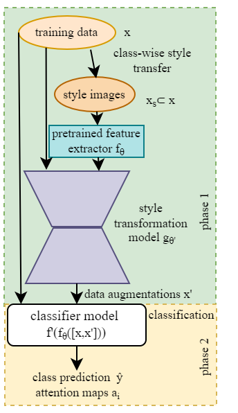
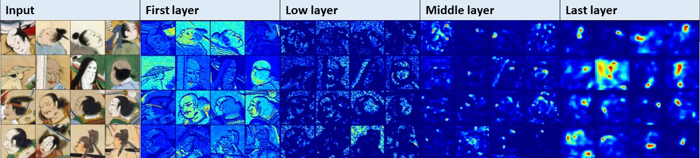

# Painting Classification with Style Transfer
Code for the VISAPP'23 paper 'Tackling Data Bias in Painting Classification with Style Transfer'.


# Style Transfer-Spatial Attention CLassiFier

## Model performance
.png)

## Spatial Attention maps


## Dataset

The datasets can be downloaded using the link:

https://drive.google.com/drive/folders/1j7nIQzmoXBm2GLPt3EJ0odl8IvLZgizo?usp=share_link

unzip kaokore_control_v1.zip

unzip kaokore_imagenet_style.zip

## Requirements

Pytorch

Pytorch Lightning

Wandb

## Usage
The datasets should be outside the repository if downloaded from the google drive link.

### Style transfer to generate the augmented dataset
python pytorch-AdaIN/train.py --save_dir models --max_iter 20000

python pytorch-AdaIN/test.py --decoder models/decoder_iter_20000_kaokore_stylized.pth

### Training and testing the model

python train_test.py

## Credits

attention.py has been adapted from https://github.com/0aqz0/pytorch-attention-mechanism.git

pytorch-AdaIN has been adapted from https://github.com/naoto0804/pytorch-AdaIN.git

## Citation
If you use our code or data, please cite:
```
@inproceedings{mridula2023tackling,
    title={Tackling Data Bias in Painting Classification with Style Transfer},
    author={Vijendran, Mridula and Li, Frederick W. B. and Shum, Hubert P. H.},
    booktitle={International Conference on Computer Vision Theory and Applications (VISAPP)},
    year={2023}
}
```
